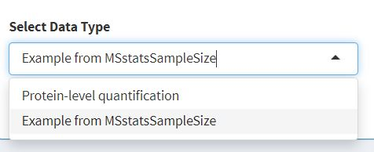
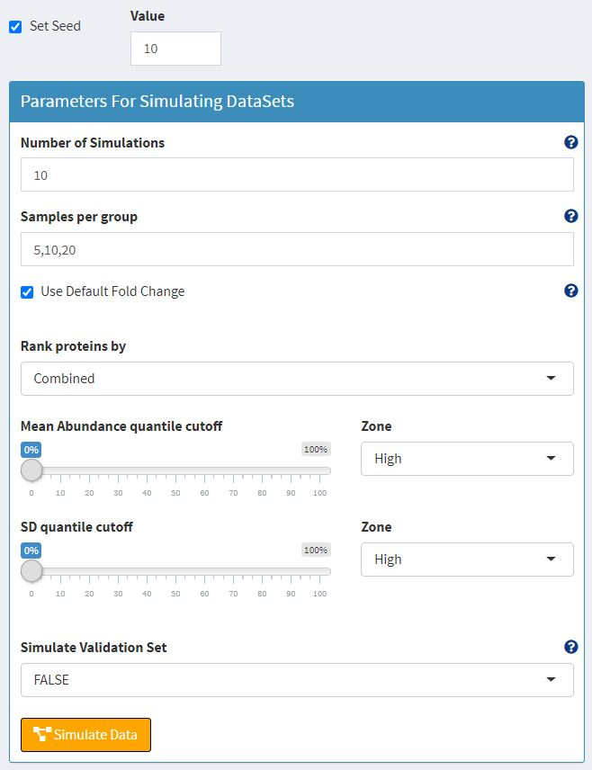
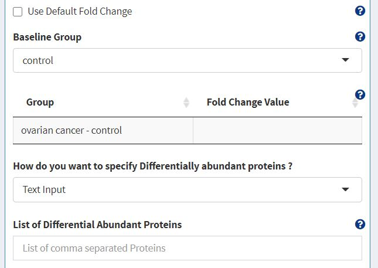
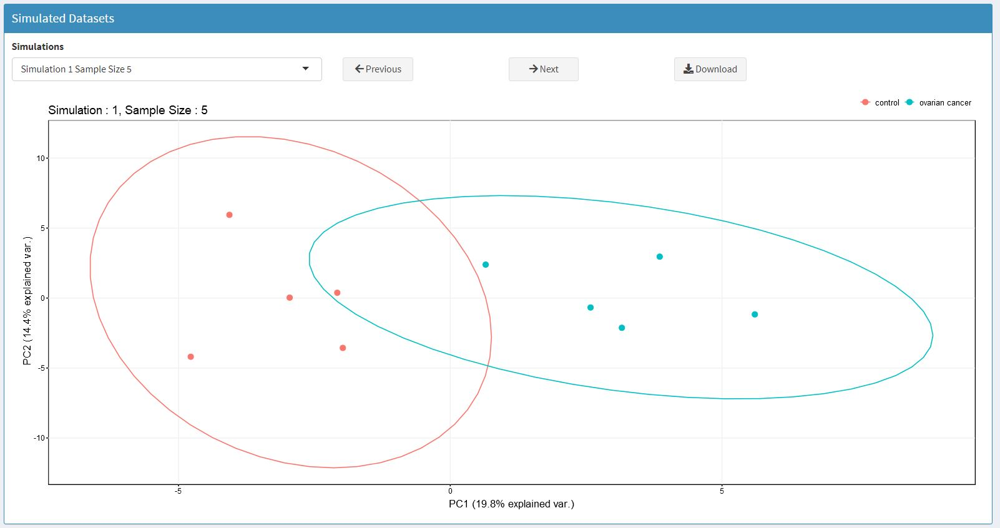
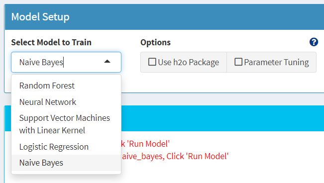
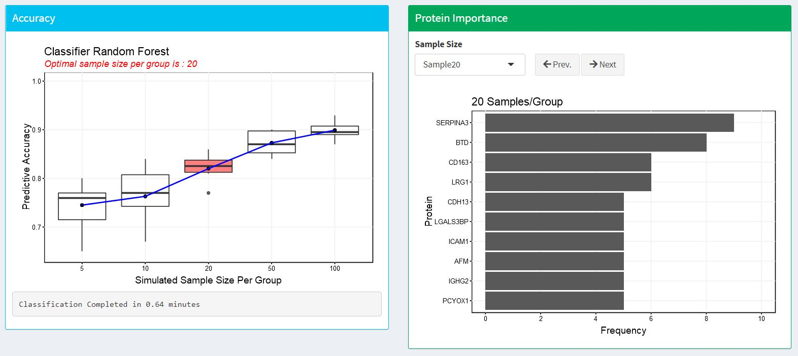

# MSstatsSampleSize

MSstatsSampleSize uses as input a list of proteins quantified in mass spectrometry runs, and their annotations in terms of biological replicates and their membership in a group (such as a disease). The package fits intensity-based linear model on the input preliminary data. 

It estimates the protein abundance variance from the fitted model and simulates data with certain number of biological replicates based on the variance estimation. It reports the mean predictive accuracy of the classifier and mean protein importance over multiple iterations of the simulation. While varying the number of biological replicates to simulate, the sample size which generates the largest predictive accuracy is estimated. And the proteins which can best separate different conditions are reported.

The package also uses the fitted models and the fold changes estimated from the models to calculate sample size for hypothesis testing. It outputs the minimal number of biological replicates per condition to acquire the expected FDR and power under different fold changes.


## Introduction to the Shiny application
`MSstats - Sample Size Estimator` is a web-based graphical user interface that 
provides a user-friendly way to visualize and report the results from 
<a href = "https://Bioconductor.org/packages/release/bioc/html/MSstatsSampleSize.html" target = "_blank">`MSstatsSampleSize`</a> package

<a href = "https://Bioconductor.org/packages/release/bioc/html/MSstatsSampleSize.html" target = "_blank">`MSstatsSampleSize`</a> is an open-source R package, available in 
Bioconductor. It allows researchers to design optimal MS-based proteomics 
experiments in terms of statistical power and the use of resources for biomarker
discovery. In particular, `MSstatsSampleSize` uses protein-level data from a 
prior MS-based proteome investigation as a basis to plan future experiments with
similar methodologies. The software therefore significantly contributes to the 
design of biological and clinical studies that involve replicates.

`MSstats - Sample Size Estimator` was created using 
<a href = "https://shiny.rstudio.com/" target = "_blank"> `R-Shiny` </a>, a Web 
Application Framework for R. It enables researchers without experience with 
R/programming to utilize the functions from MSstatsSampleSize.

## Notes:
* As a preliminary experiment, more biological replicates are preferred but a 
minimal of three biological replicates per condition` are required in the input
dataset.
* MSstatsSampleSize uses simulation experiments to mimic the future experiments 
with different sample sizes. Thus, increasing the simulated sample size and the 
number of simulations are expected to  increase the running time.


## Getting Started

The Web application follows the work-flow given below, we will walkthrough each
process of the work-flow in this manual.


Keep an eye out for buttons highlighted in orange, these buttons indicate 
possible next steps in a planned experiment. They will look like the ones shown 
below.  
 


## Import Data

Navigate to the Data Import panel from the Home panel by either clicking the
orange `Start` button or by clicking on `Import data` on the sidebar.  
The Data Import Wizard lets the user upload protein abundance and annotation
data of their choice, alternatively an example dataset from the `MSstatsSampleSize`
package can be loaded to explore the web application. A snapshot of the data
that is available within the web application is given below.  

```
cat("Sample protein abundance data, with rows as proteins and columns as biorepicates")
head(MSstatsSampleSize::OV_SRM_train)[,1:5]
```

```
cat("Sample annotation data")
head(as.matrix(MSstatsSampleSize::OV_SRM_train_annotation))
```

To upload, select `Protein-level quantification` in the <b>Select Data Type</b>
drop down menu. When presented with the options to upload files, please upload
Protein abundance and Annotation files to requested slots as shown in the figures
below.  

<b style = "color:red"><i>A word of caution :</i></b> The data uploaded to the 
application is expected to be transformed by one of the several converters 
available in the MSstats package. The data is expected to be log transformed.  

<div></div>
<br>
<div></div>  


## Simulate Datasets  

Simulating datasets with the ability to reproduce the simulation experiment is 
provided by this shiny application. Various parameters which are required for 
the simulation can be tuned and adjusted through this panel.

<div style="width:400px; height:500px; float: right; margin-right: 10px;
margin-top: 10px; margin-left: 10px; margin-bottom 50px">

</div>

<br>
<b>Set Seed:</b> The set seed option, when selected allows the user to specify
a seed value. This enables reproducibility in the data simulation process as 
well as the dataset classification process.  

<b>Number of Simulations:</b> This parameter lets the user decide the number 
datasets that need to be simulated.  

<b>Samples per group:</b> Defines the number of samples per condition existing 
in the input dataset need to be simulated, a minimum of 3 samples per group need
to be provided to create a viable dataset.  

<b>Rank proteins by:</b> Proteins can be selected in a multitude of ways, 
capabilities to selected proteins are provided by either selecting them based of
their Mean abundances, Standard deviations or a combined effect of both.  

<b>Mean Abundance quantile and SD cutoffs:</b> The mean abundance cutoff and 
standard deviations (SD) cutoff values are quantile values above or at or below 
which proteins needs to be selected for simulating the datasets. The Zone 
dropdown lets the user select High or Low values to be selected.  

<b>Simulate Validation Set:</b> This toggle option lets the user decide if 
additional data needs to be simulated for validating the results of the model 
training that occurs in the classification phase of the application.  

<div style="width:400px; height:300px; float: left; margin-right: 10px;
margin-top: 10px; margin-left: 10px; margin-bottom: 10px">

</div>
<br>
<br>
<br>
<br>
<br>
<b>Validation Samples per group:</b> This input allows the users to specify the
number of validation samples to simulate per group. By default the entire 
input dataset is considered as a validation set for the simulated datasets.  

<b>Use Default Fold Change:</b> This toggle lets the user control the fold 
change values between the different groups presented in the input data. The 
default selection for this is to use the default fold change from the data.  

<b>Baseline Group:</b>  Users can define the baseline group according to which 
the fold changes are identified, the table following this option lets the user 
define numeric values for the different fold changes.  
<br>
<b>Specifying Deferentially abundant proteins:</b> This feature lets the user 
control the protein selection process, pre-defining the deferentially abundant 
proteins by either providing a comma separated text value in the typing area 
provided, alternatively a text file with comma separated values can be uploaded 
to the interface.

<b>Simulate Data :</b> The orange simulate data button begins the simulation
of the data considering all the provided parameters, the Mean and Standard deviation
plot is highlighted, the proteins belonging to the highlighted region have 
been selected for the simulation process. The selection process depends on how the
proteins have been ranked and what their quantile cutoff are.

PCA analysis of the simulated datasets is carried out and visualized. These 
plots are downloadable and can be used for further research.



## Plan Experiment

<div style="float: right; width:500px; height=500px; margin-right: 10px;
margin-top: 10px; margin-left: 10px; margin-bottom 10px">

</div>
<br>
<div>
The Shiny application has capabilities to use 5 different classification 
algorithms to identify the optimal sample size from the simulated datasets.
The classification algorithms are listed as below:  

<ul>
  <li>Random Forest</li>
  <li>Neural Networks</li>
  <li>Support Vector Machine with Linear Kernel</li>
  <li>Logistic Regression</li>
  <li>Naive Bayes</li>
</ul>
<br>

The application provides features to use h2o to train models with extremely 
large number of predictors, although this feature is currently in testing phase 
some of its caveats are as follows:  

<ul>
  <li>Hardware requirement for h2o may not always be met on a user machine</li>
  <li>Setting up a cloud based h2o machine for public use is not be feasible, 
  and data security/privacy concerns may discourage users</li>
</ul>  

Selecting the required classifier and hitting the <b>Run Model</b> button runs
the classification algorithm on the simulated datasets. The machine learning
process selects the top 10 features on every simulated datasets to train the 
classifiers. An optimal sample size is suggested after the classifiers are trained,
the optimal sample size is highlighted in the Accuracy plot. The protein 
importance plots highlights the most recurring proteins that have been selected
for model training amongst all the datasets.
</div>
<div style="float: center; margin-right: 10px;
margin-top: 10px; margin-left: 10px; margin-bottom 10px">


</div>  

A pdf report of the entire experiment that was carried out can be generated via
the User interface by clicking the <b>Generate Report</b> button. The report 
contains the optimal solution that was identified, the plots that visualize this
information. The report also contains the details of all the parameters that 
were used to simulate the datasets and chunks of code which can help the researcher
reproduce the experiment on their own machines if required.

